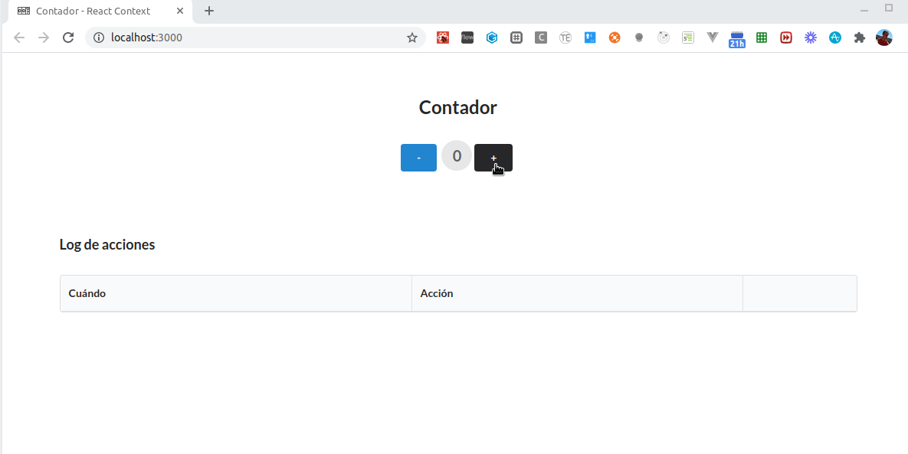
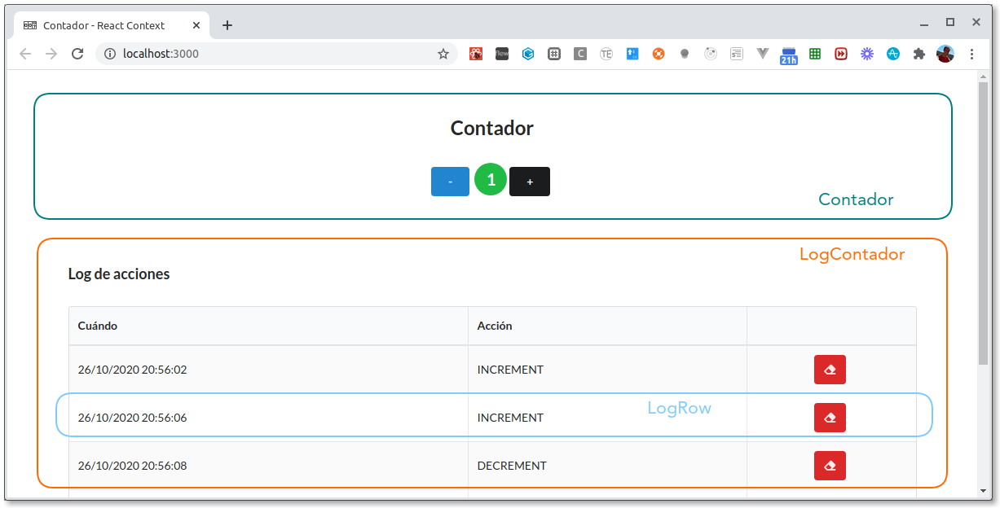

# Contador en React Context

[](https://travis-ci.org/uqbar-project/eg-contador-react-context)



## La aplicación

El ejemplo consiste en un simple contador numérico, al que le podemos incrementar o decrementar su valor de uno en uno. Para ayudar a entender el funcionamiento de React Context, incorporamos un _log_ que mostrará cada operación de suma o resta que haya pedido el usuario, con la opción de poder borrarlo.

## React Context

El API de React Context permite unificar el estado entre los componentes de una aplicación.

### Breve introducción a React Context


React Context agrega como conceptos:

- el **Context** que es simplemente la instancia de ReactContext

- el **Provider** con el vamos a encerrar a todos nuestros componentes que queremos que estén escuchando nuestro estado global

- el **Consumer** que nos permite consumir los datos globales, pero los hooks de react nos dan una función que nos hace todo más facil :tada:


## Los componentes

Tenemos tres componentes en nuestra aplicación:

- **Contador:** el label que muestra el valor y los dos botones para sumar o restar ese valor
- **LogContador:** el container general que genera la tabla y su encabezado, y trabaja con la lista de logs de las operaciones que se van produciendo
- **LogRow:** el componente que sabe mostrar un log dentro de una tabla



## Nuestro estado compartido

En el context vamos a definir como estado compartido el valor numérico actual y la lista de logs:

archivo _src/context/Context.js_

```js
export const Context = createContext()
```

## Definiendo nuestro propio Provider

Tendremos tres acciones: subir un valor, bajar un valor (ambas generan un nuevo log) y eliminar un log. Nuestro componente provider es simplemente un componente react, encargado de mantenery manejar el estado de nuestra app.

archivo _src/context/Context.js_

```javascript
export class Provider extends React.Component {
    state = {
        logs: [],
        count: 0
    }
    decrement = () => {
        this.setState({
            logs: this.state.logs.concat(new Log('DECREMENT')),
            count: this.state.count - 1
        })
    }
    increment = () => {
        this.setState({
            logs: this.state.logs.concat(new Log('INCREMENT')),
            count: this.state.count + 1
        })
    }
    deleteLog = (logToDelete) => {
        const newLogs = this.state.logs.filter((log) => logToDelete.id !== log.id)
        this.setState({
            logs: newLogs
        })
    }
    render() {
        const value = {
            count: this.state.count,
            logs: this.state.logs,
            decrement: this.decrement,
            increment: this.increment,
            deleteLog: this.deleteLog
        }
        return (
            <Context.Provider value={value}>
                {this.props.children}
            </Context.Provider>

        )
    }
}
```

Recordemos que `this.props.children` permite definir componentes React hijos asociados a nuestro Provider, que simplemente los muestra (es una especie de **template method**).

```js
const App = () => (
  <Provider >
    <Contador />
    <LogContador />
  </Provider>
)
```

## Enlazando las acciones con cada componente

Para mapear las acciones y estado a los componentes deberiamos usar un **Consumer**. Al igual que para los casos de `useState` y `useEffect`, React Context trae una función que se llama `useContext` a la cual le debemos pasar por argumento el **Context** que queremos usar. 

### Componente Contador

Mapearemos entonces en el componente contador:

- como **state del context** la propiedad count (no nos interesan los logs)
- como **acciones**, las acciones para subir o bajar el contador (increment y decrement)

```js
const { count, decrement, increment } = useContext(Context)
```

Entonces podemos usar libremente en nuestra función render las referencias count, increment y decrement:

```js
  return (
    <Container textAlign="center">
      ...
      <div>
        <Button primary data-testid="button_minus" onClick={decrement}>-</Button>
        <Label data-testid="contador" circular color={color(count)} size="huge">{count}</Label>
        <Button secondary data-testid="button_plus" onClick={increment}>+</Button>
      </div>
    </Container>
  )
```

### Componente LogContador

En el componente LogContador mapearemos:

- como **state del context** la propiedad logs
- como **accion**, la funcion de borrar un log que recibe por parametro el log..

```js
const { deleteLog, logs } = useContext(Context)
```

El lector puede ver cómo el botón Eliminar llama a la función `deleteLog` y cómo se reciben los logs para renderizar cada LogRow.

## Testing

### Configuración

Anteriormente el framework Enzyme (testeo unitario de React) requería configurar un adaptador para el Context en el archivo `src/setupTests.js`:

```js
import 'jest-enzyme'
import { configure } from 'enzyme'
import Adapter from 'enzyme-adapter-react-16'
configure({ adapter: new Adapter() })
```

Afortunadamente esto no es necesario con `react-testing-library`.

### Tests sobre el contador

Hablaremos de los tests más interesantes, el resto pueden consultarse en [App.test.js](./src/App.test.js). Veamos por ejemplo, cómo simulamos que al presionar el botón **+**

- por un lado sube el valor del contador
- por otro lado se genera una nueva fila en el log

```js
test('si se presiona el botón +, se agrega un log', () => {
  const { getByTestId, getAllByTestId } = render(
    <Provider>
      <App />
    </Provider>
  )
  fireEvent.click(getByTestId('button_plus'))
  expect(getAllByTestId('LogRow')).toHaveLength(1)
})

test('si se presiona el botón +, el contador pasa a estar en 1', () => {
  const { getByTestId } = render(
    <Provider>
      <App />
    </Provider>
  )
  fireEvent.click(getByTestId('button_plus'))
  expect(getByTestId('contador')).toHaveTextContent('1')
})
```

Estos tests no son tan unitarios: prueba que se presiona el botón +, eso dispara la función increment(), lo que devuelve un nuevo estado y eso termina generando el render de la vista, por lo tanto esperamos que en el Label ahora esté el valor 1 y que se muestre un nuevo log.

Fíjense que elegimos repetir las dos líneas de código que forman parte del Arrange / Act en ambos tests.

- por un lado, queremos mantener ambos tests separados, porque están probando distintos componentes (no es una buena idea tener un solo test con los dos expect porque pertenecen a casos de prueba diferentes)
- por otra parte, envolver esas líneas en una función la "alejaría" lo que luego necesitamos preguntar: `getAllByTestId`, `getByTestId` tendrían que ser devueltas por esa función, oscureciendo un poco el entendimiento:

```js
describe('si se presiona el botón -', () => {
  let resultApp

  beforeEach(() => {
    resultApp = render(
      <Provider>
        <App />
      </Provider>
    )
    fireEvent.click(resultApp.getByTestId('button_minus'))
  })

  test('se agrega un log', () => {
    const { getAllByTestId } = resultApp
    expect(getAllByTestId('LogRow')).toHaveLength(1)
  })

  test('el contador pasa a estar en -1', () => {
    const { getByTestId } = resultApp
    expect(getByTestId('contador')).toHaveTextContent('-1')
  })
})
```

En definitiva, aquí hay un _trade off_ entre cierta repetición y la legibilidad del test mismo. Por el momento, dado que son solo dos líneas, nos quedamos con la idea original.

### Delete del log

Y el último test es una prueba end-to-end bastante exhaustiva: el usuario presiona el botón +, eso además de modificar el valor agrega un log. Entonces podemos presionar el botón "Eliminar log" para luego chequear que la lista de logs queda vacía:

```js
test('cuando el usuario presiona el botón Delete Log se elimina un log', () => {
  const { queryAllByTestId, getByTestId } = render(
    <Provider>
      <App />
    </Provider>
  )
  const actualIndex = Log.getLastIndex()
  fireEvent.click(getByTestId('button_plus'))
  expect(queryAllByTestId('LogRow')).toHaveLength(1)
  fireEvent.click(getByTestId('button_deleteLog_' + actualIndex))
  expect(queryAllByTestId('LogRow')).toHaveLength(0)
})
```
