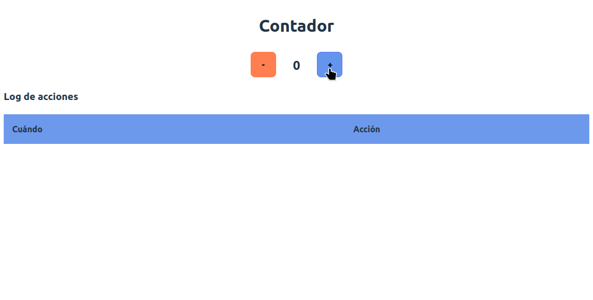
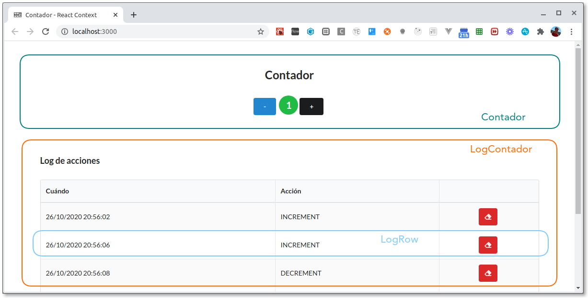

# Contador en React Context

[](https://github.com/uqbar-project/eg-contador-react-context/actions/workflows/build.yml) [](https://codecov.io/gh/uqbar-project/eg-contador-react-context)



## La aplicación

El ejemplo consiste en un simple contador numérico, al que le podemos incrementar o decrementar su valor de uno en uno. Para ayudar a entender el funcionamiento de React Context, incorporamos un _log_ que mostrará cada operación de suma o resta que haya pedido el usuario, con la opción de poder borrarlo.

## React Context

El API de React Context permite unificar el estado entre los componentes de una aplicación.

### Breve introducción a React Context

React Context agrega como conceptos:

- el **Context** que es simplemente la instancia de ReactContext

- el **Provider** con el vamos a encerrar a todos nuestros componentes que queremos que estén escuchando nuestro estado global

- el **Consumer** que nos permite consumir los datos globales, pero los hooks de react nos dan una función que nos hace todo más facil :tada:


## Los componentes

Tenemos tres componentes en nuestra aplicación:

- **Contador:** el label que muestra el valor y los dos botones para sumar o restar ese valor
- **LogContador:** el container general que genera la tabla y su encabezado, y trabaja con la lista de logs de las operaciones que se van produciendo
- **LogRow:** el componente que sabe mostrar un log dentro de una tabla



## Nuestro estado compartido

En el context vamos a definir como estado compartido el valor numérico actual y la lista de logs:

archivo _src/context/Context.tsx_

```js
export const Context = createContext<LogContext | null>(null)
```

## Definiendo nuestro propio Provider

Tendremos tres acciones: subir un valor, bajar un valor (ambas generan un nuevo log) y eliminar un log. Nuestro componente provider es simplemente un componente react, encargado de mantener y actualizar el estado de la  app:

- el valor actual
- los logs

archivo _src/context/Context.tsx_

```ts
export const Provider = ({ children }: { children: ReactNode }) => {
  const [count, setCount] = useState(0)
  const [logs, setLogs] = useState<Log[]>([])
```

El contexto publica en una referencia value lo que podemos luego utilizar en los componentes que trabajen con ese contexto:

- el valor actual (el getter)
- la lista de logs (solo el getter nuevamente)
- y funciones para subir y bajar el valor
- y una función que elimine el log

```ts
  const addLog = (action: ActionLog) => {
    const newLogs = logs.concat(new Log(action))
    setLogs(newLogs)
  }

  const value = {
    // Publicamos el estado
    count,
    logs,
    // Funciones que afectan al estado
    decrement: () => {
      addLog(ActionLog.DECREMENT)
      setCount(count - 1)
    },
    increment: () => {
      addLog(ActionLog.INCREMENT)
      setCount(count + 1)
    },
    deleteLog: (logToDelete: Log) => {
      // fíjense que el context está tomando una responsabilidad
      const newLogs = logs.filter((log) => logToDelete.id !== log.id)
      setLogs(newLogs)
    }
  }
```

Por último devuelve un componente React que trabaja con la `prop children` porque el Context va a decorar (envolver, wrappear) los componentes que lo utilicen:

```tsx
  return (
    <Context.Provider value={value}>
      {children}
    </Context.Provider>
  )
}
```

Recordemos que `this.props.children` permite definir componentes React hijos asociados a nuestro Provider, que simplemente los muestra (es una especie de **template method**).

```tsx
const App = () => (
  <Provider >
    <Contador />
    <LogContador />
  </Provider>
)
```

Un detalle respecto a los cambios de estado: es importante que todo cambio de estado modifique el objeto con el que se trabaja. En el agregado de un log, podemos utilizar el método push como alternativa, siempre que generemos una copia:

```ts
  const addLog = (action: ActionLog) => {
    const newLogs = [...logs]
    newLogs.push(new Log(action))
    setLogs(newLogs)
  }
```

Si no hacemos la copia superficial `[...logs]`, los cambios no se distribuirán a los componentes hijos.

## Enlazando las acciones con cada componente

Para mapear las acciones y estado a los componentes deberiamos usar un **Consumer**. Al igual que para los casos de `useState` y `useOnInit/useEffect`, React Context trae una función que se llama `useContext` a la cual le debemos pasar por argumento el **Context** que queremos usar. 

### Componente Contador

Mapearemos entonces en el componente contador:

- como **state del context** la propiedad count (no nos interesan los logs)
- como **acciones**, las acciones para subir o bajar el contador (increment y decrement)

```tsx
const { count, decrement, increment } = useContext(Context)!
```

Entonces podemos usar libremente en nuestra función render las referencias count, increment y decrement:

```tsx
  return (
    <div className="container">
      ...
      <div className="contador">
        <button data-testid="button_minus" className="secondary" onClick={decrement}>-</button>
        <label data-testid="contador">{count}</label>
        <button data-testid="button_plus" className="primary" onClick={increment}>+</button>
      </div>
    </div>
  )
```

### Componente LogContador

En el componente LogContador mapearemos:

- como **state del context** la propiedad logs
- como **acción**, la funcion de borrar un log que recibe por parametro el log..

El lector puede ver cómo el botón Eliminar llama a la función `deleteLog` y cómo se reciben los logs para renderizar cada LogRow.

## Testing

### Tests sobre el contador

Hablaremos de los tests más interesantes, el resto pueden consultarse en [App.test.tsx](./src/App.test.tsx). Veamos por ejemplo, cómo simulamos que al presionar el botón **+**

- por un lado sube el valor del contador
- por otro lado se genera una nueva fila en el log

```tsx
test('si se presiona el botón +, se agrega un log', () => {
  render(
    <App />
  )
  fireEvent.click(screen.getByTestId('button_plus'))
  expect(screen.getAllByTestId('LogRow')).toHaveLength(1)
})

test('si se presiona el botón +, el contador pasa a estar en 1', () => {
  render(
    <App />
  )
  fireEvent.click(screen.getByTestId('button_plus'))
  expect(screen.getByTestId('contador').textContent).toBe('1')
})
```

Estos tests no son tan unitarios: prueba que se presiona el botón +, eso dispara la función increment(), lo que devuelve un nuevo estado y eso termina generando el render de la vista, por lo tanto esperamos que en el Label ahora esté el valor 1 y que se muestre un nuevo log.

Fíjense que elegimos repetir las dos líneas de código que forman parte del Arrange / Act en ambos tests. Queremos mantener ambos tests separados, porque están probando distintos componentes (no es una buena idea tener un solo test con los dos expect porque pertenecen a casos de prueba diferentes)

### Delete del log

Y el último test es una prueba end-to-end bastante exhaustiva: el usuario presiona el botón +, eso además de modificar el valor agrega un log. Entonces podemos presionar el botón "Eliminar log" para luego chequear que la lista de logs queda vacía:

```tsx
test('cuando el usuario presiona el botón Delete Log se elimina un log', () => {
    render(
      <App />
    )
    const actualIndex = Log.getLastIndex()
    fireEvent.click(screen.getByTestId('button_plus'))
    expect(screen.queryAllByTestId('LogRow')).toHaveLength(1)
    fireEvent.click(screen.getByTestId('button_deleteLog_' + actualIndex))
    expect(screen.queryAllByTestId('LogRow')).toHaveLength(0)
  })
```

## Material relacionado

- [Context - documentación oficial de React](https://react.dev/learn/passing-data-deeply-with-context)
- [useContext](https://react.dev/reference/react/useContext)
- [createContext](https://react.dev/reference/react/createContext)