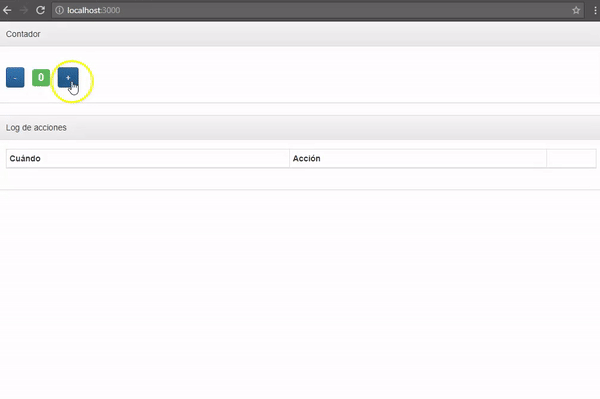
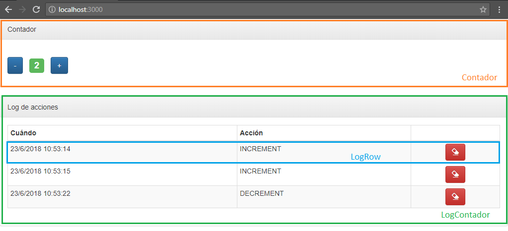

# Contador en React Context

[](https://travis-ci.org/uqbar-project/eg-contador-react-context)



# La aplicación

El ejemplo consiste en un simple contador numérico, al que le podemos incrementar o decrementar su valor de uno en uno. Para ayudar a entender el funcionamiento de React Context, incorporamos un _log_ que mostrará cada operación de suma o resta que haya pedido el usuario, con la opción de poder borrarlo.

# React Context

El API de React Context permite unificar el estado entre los componentes de una aplicación.

## Breve introducción a React Context


React Context agrega como conceptos:

- el **Context** que es simplemente la instancia de ReactContext

- el **Provider** con el vamos a encerrar a todos nuestros componentes que queremos que estén escuchando nuestro estado global

- el **Consumer** que nos permite consumir los datos globales, pero los hooks de react nos dan una función que nos hace todo más facil :tada:


## Los componentes

Tenemos tres componentes en nuestra aplicación:

- **Contador:** el label que muestra el valor y los dos botones para sumar o restar ese valor
- **LogContador:** el container general que genera la tabla y su encabezado, y trabaja con la lista de logs de las operaciones que se van produciendo
- **LogRow:** el componente que sabe mostrar un log dentro de una tabla



## Nuestro estado compartido

En el context vamos a definir como estado compartido el valor numérico actual y la lista de logs:

archivo _src/context/Context.js_

```javascript
export const Context = createContext()
```

## Definiendo nuestro propio Provider

Tendremos tres acciones: subir un valor (INCREMENT), bajar un valor (DECREMENT), ambas generan un nuevo log y eliminar un log (DELETE_LOG).

Nuestro componente provider, no es algo mas que un componente react tambien, el cual mantiene y maneja el estado de nuestra app.

archivo _src/context/Context.js_

```javascript
export class Provider extends React.Component {
    state = {
        logs: [],
        count: 0
    }
    decrement = () => {
        this.setState({
            logs: this.state.logs.concat(new Log('DECREMENT')),
            count: this.state.count - 1
        })
    }
    increment = () => {
        this.setState({
            logs: this.state.logs.concat(new Log('INCREMENT')),
            count: this.state.count + 1
        })
    }
    deleteLog = (logToDelete) => {
        const newLogs = this.state.logs.filter((log) => logToDelete.id !== log.id)
        this.setState({
            logs: newLogs
        })
    }
    render() {
        const value = {
            count: this.state.count,
            logs: this.state.logs,
            decrement: this.decrement,
            increment: this.increment,
            deleteLog: this.deleteLog
        }
        return (
            <Context.Provider value={value}>
                {this.props.children}
            </Context.Provider>

        )
    }
}
```

## Enlazando las acciones con cada componente

Para mapear las acciones y estado a los componentes deberiamos usar un **Consumer**,pero gracias a la magia de react, nos regala una funcion que se llama `useContext` a la cual le debemos pasar por argumento el **Context** que queremos usar

Mapearemos entonces en el componente contador:

- como **state del context** la propiedad count (no nos interesan los logs)
- como **acciones**, las acciones para subir o bajar el contador (increment y decrement )

```js
const { count, decrement,increment } = useContext(Context)

```

En el componente LogContador mapearemos:

- como **state del context** la propiedad logs
- como **accion**, la funcion de borrar un log que recibe por parametro el log..

```js
const { deleteLog, logs } = useContext(Context)

```

# Testing

Tenemos un archivo `src/setupTests.js`, que nos sirve para configurar todos los test de nuestro ecosistema (cosa burocratica de react + enzyme)

```javascript
import 'jest-enzyme'
import { configure } from 'enzyme'
import Adapter from 'enzyme-adapter-react-16'
configure({ adapter: new Adapter() })
```

La idea seria generar un par de funciones auxiliares que nos permitan dejar los tests simples:
```javascript
const getLabel = (componente) => componente.find('Label')
const getButtonPlus = (componente) => componente.find('[data-testid="button_plus"]').at(0)
const getButtonMinus = (componente) => componente.find('[data-testid="button_minus"]').at(0)
const getLog = (componente) => componente.find('LogRow')
const getDeleteLogButton = (componente, id) => componente.find(`[data-testid="button_deleteLog_${id}"]`).at(0)
```

¿Y por qué usamos el `data-testid` y no el `id` de html ?  :thinking:

Si usamos el id estamos acoplando un selector de css a nuestros tests e incluso podría ser que este tenga otro valor a futuro, en cambio `data-testid` es un atributo específicamente para los tests y no hay probabilidad que cambie.

¿Qué es ese `at(0)` en las funciones auxiliares ?

Lamentablemente bootstrap tiene un bug y renderiza erróneamente los `<Button/>`, nos muestra 2 `data-testid` dentro del html

El primer test es sencillo:

```javascript
it('el contador inicialmente está en 0', () => {
  const wrapperContador = mount(<App />)
  expect(getLabel(wrapperContador).text()).toBe('0')
})
```

Dado que en lugar de la función shallow() estamos usando la función mount(), tenemos el componente HTML cargado en profundidad (no necesitamos forzar los componentes hijos con el mensaje dive()). Entonces podemos buscar el Label que contiene el valor inicialmente en 0 (un String, salvo que el lector lo quiera convertir a un número).

El segundo test no es tan unitario: prueba que se presiona el botón +, eso mapea contra props.increment() que dispara la acción increment() hacia el store, que devuelve un nuevo estado y eso termina generando el render de la vista, por lo tanto esperamos que en el Label ahora esté el valor 1 y que se muestre un nuevo log:

```javascript
describe('cuando el usuario presiona el botón +', () => {
  let wrapperContador
  beforeEach(() => {
    wrapperContador = mount(<App />)
    getButtonPlus(wrapperContador).simulate('click')
  })

  it('se agrega un log', () => {
    expect(wrapperContador.find('LogRow')).toHaveLength(1)
  })

  it('el contador pasa a estar en 1', () => {
    expect(getLabel(wrapperContador).text()).toBe('1')
  })
})
```

Lo mismo hacemos para decrementar:

```javascript
describe('cuando el usuario presiona el botón -', () => {
  let wrapperContador
  beforeEach(() => {
    wrapperContador = mount(<App />)
    getButtonMinus(wrapperContador).simulate('click')
  })

  it('se agrega un log', () => {
    expect(wrapperContador.find('LogRow')).toHaveLength(1)
  })

  it('el contador pasa a estar en -1', () => {
    expect(getLabel(wrapperContador).text()).toBe('-1')
  })
})
```

Hacemos el uso de `beforeEach` para tener un diferente componente en cada `it`, así no tenemos estado compartido entre los tests

Y el último test es una prueba end-to-end bastante exhaustiva: el usuario presiona el botón +, eso además de modificar el valor agrega un log. Entonces podemos presionar el botón "Eliminar log" para luego chequear que la lista de logs queda vacía:

```javascript
it('cuando el usuario presiona el botón Delete Log se elimina un log', () => {
  const wrapperContador = mount(<App />)
  const actualIndex = Log.getLastIndex()
  getButtonPlus(wrapperContador).simulate('click')
  expect(getLog(wrapperContador)).toHaveLength(1)
  getDeleteLogButton(wrapperContador, actualIndex).simulate('click')
  expect(getLog(wrapperContador)).toHaveLength(0)
})
```

